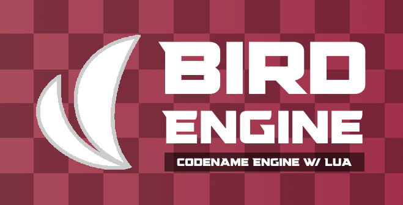

# Friday Night Funkin' - Bird Engine

Want to use Codename Engine but you want to use Lua (hi psych users :3) or are you still learning Haxe (for HScript)? This is the perfect fork to start with.

Based on Codename Engine, this custom engine includes:

- Full Lua Script support over OOP-like programming **(i.e. Not compatible with Psych Lua)**
  - Gameplay Scripting
  - Customizable States/Substates (and Custom ones too)

## Based on Codename Engine

Codename Engine is a cross platform [Friday Night Funkin'](https://github.com/FunkinCrew/Funkin) Engine aimed at simplifying modding focusing on softcoding, along with extensiblity and ease of use. 
It is the the official successor of the previously well known [Yoshi Engine](https://github.com/CodenameCrew/YoshiCrafterEngine).

The engine uses [HaxeFlixel](https://haxeflixel.com/) and it mainly features:
- A full scripting system with an optimized fork of [Hscript](https://lib.haxe.org/p/hscript/) (its name is [Hscript Improved](https://github.com/CodenameCrew/hscript-improved))
- Uses forks of popular libraries tailored specifically for the engine for the goal of better optimization.
- Modding system and softcoding is as capable as source coding.
- Focuses heavily on optimization, and encourages its users to also take on optimization practices.
- Many modding tools without changing the core gameplay and the base to mod on.
- Allows modularity using addons and mods that apply on top of the core mod.
- Advanced editors which allows for possibly better experience and easiness when creating the mod.
- Much more can be read [HERE](FEATURES.md)

> [!NOTE]
> Please keep in mind that, despite these differences, we do not consider our engine to be any better or worse than the others.

---

> [!CAUTION]
> Want to use this project's code for different purposes or something similar? Check out the ***Usage Info*** part below first, it basically explains what you can do or not do! 
> We love open source but we also love proper credits for having respect of all the people who worked hard on this project!!

> [!WARNING]
> Before making issues or if you need help with something, check our website [HERE](https://codename-engine.com/). 
> It contains a wiki of how to mod with EXAMPLES, an api, lists of mods made with Codename Engine and more!

> [!TIP]
> Want to stay updated with this project? 
> Check out our [patch notes](PATCHNOTES.md)!

---

  

---

> [!NOTE]
> Codename Engine as for now supports **Windows x64**, **Mac OS x64** and **Linux x64**. 
> More platforms will soon come, stay tuned! 
> - [ ] **Web (HTML5) Support**
> - [ ] **Mobile Support**

  
<h2>How to download</h2>

  - Stable builds of the engine can be found on our [GameBanana](https://gamebanana.com/mods/598553) or our [itch.io](https://nex-isdumb.itch.io/codename-engine) pages.
  - Latest *EXPERIMENTAL* builds of the engine can be found in the [Actions](https://github.com/CodenameCrew/CodenameEngine/actions) tab. **REQUIRES A GITHUB ACCOUNT!!**

  If you don't have a GitHub account to download experimental builds, you can also go onto our [official website](https://codename-engine.com/) and click the download button for the respective operating system under the **Experimental** section.

  
<h2>How to mod</h2>

  Check out our wiki [HERE](https://codename-engine.com/wiki/)

  
<h2>How to setup and build</h2>

  Check out our guide [HERE](building/README.md)

  
<h2>Usage Info</h2>

  ### You can:
  - Download and play the engine with its mods and modpacks
  - Mod and fork the engine (without using it for illicit purposes)
  - Contribute to the engine (for example through *Pull Requests*, *Issues*, etc.)
  - Create a sub engine with Codename Engine as **TEMPLATE** with **CREDITS** (for example leaving the *credits menu submenu with the GitHub contributors* and putting the *[main devs](https://github.com/CodenameCrew)* in a *README* specifying that it's a *sub engine from Codename Engine*)
  - Release excutable mods that use Codename Engine as source (specifing that uses Codename Engine by for example the same way written above this)
  - Release Codename Engine modpacks

  ### You can't:
  - Create a *side/new/etc* engine (or mod that doesn't use Codename Engine) using Codename Engine's code
  - Steal code from Codename Engine for another different project that is not Codename Engine related (Codename Engine mods excluded) without properly crediting
  - Release the entirety of Codename Engine on platforms (mods that use Codename Engine as source are fine)

  #### *If you need more info or feel like asking to do something which is not listed here, ask us directly on our [discord server](https://discord.com/servers/codename-engine-860561967383445535)!*

  
<h2>Credits</h2>

- All main Credits can be seen inside the Engine and specifically [HERE](https://github.com/CodenameCrew/CodenameEngine/graphs/contributors)
- Credits to the [FlxAnimate](https://github.com/Dot-Stuff/flxanimate) team for the Animate Atlas support
- Credits to Smokey555 for the backup Animate Atlas to spritesheet code
- Credits to MAJigsaw77 for [hxvlc](https://github.com/MAJigsaw77/hxvlc) (video cutscene/mp4 support) and [hxdiscord_rpc](https://github.com/MAJigsaw77/hxdiscord_rpc) (discord rpc integration)
- Credits to [TheoDev](https://github.com/TheoDevelops) for [FunkinModchart](https://lib.haxe.org/p/funkin-modchart/). ***(library used for modcharting features)***
- Credits to [Ninjamuffin99](https://github.com/ninjamuffin99) and the [Funkin Crew](https://github.com/FunkinCrew) for the base game Friday Night Funkin'

